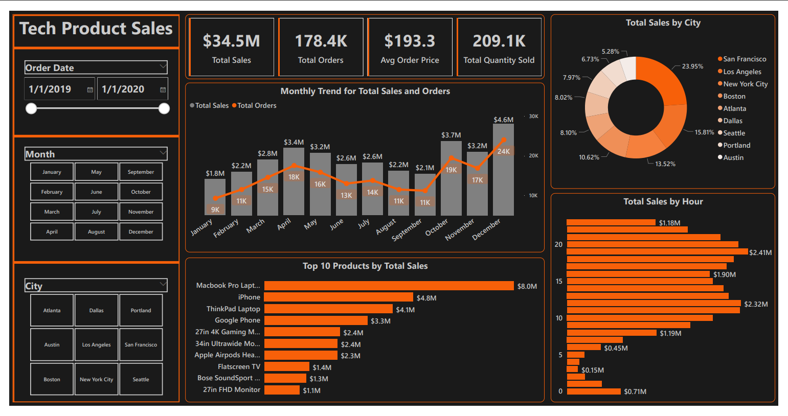
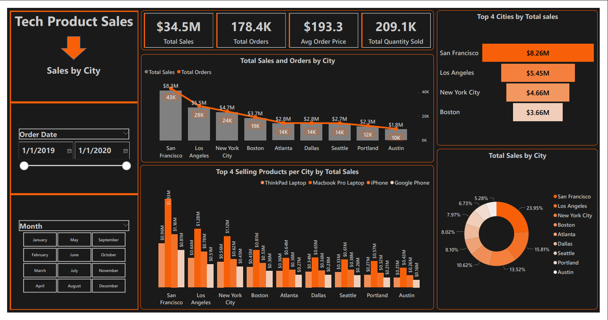
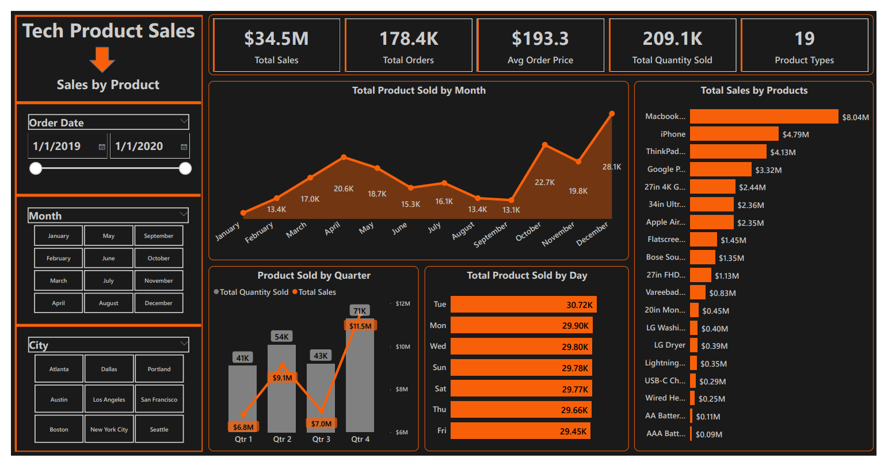

# Tech-Product-Sales-Analysis-SQL-Power-BI

**Purpose:** Analyze sales data to identify trends, top-selling products, and revenue metrics for business decision-making. 

**Description:** In this project, we will dive into a large sales dataset to extract valuable insights. we will explore sales trends over time, identify the best-selling products, calculate revenue metrics such as total sales and profit margins, and create visualizations to present your findings effectively. This project showcases your  ability to manipulate and derive insights from large datasets, enabling you to make data-driven recommendations for optimizing sales strategies.

